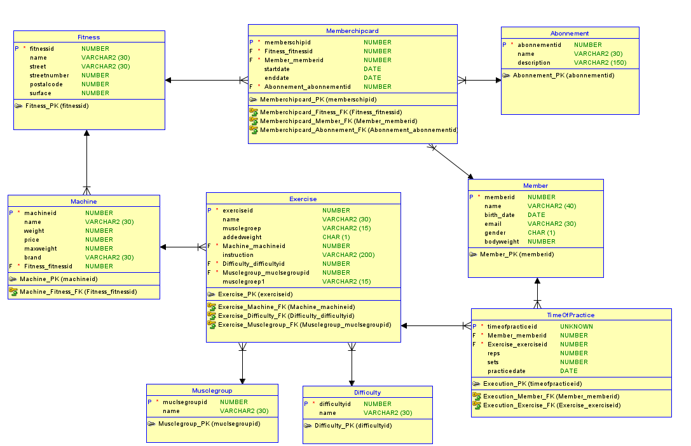

Milestone 2: Modellering
---
TOP DOWN MODELERING
---

Conceptueel Model
---

    Entiteittypes + Attributen + PK
---
- Fitness (**fitness_id**, name, street, streetnumber, postalcode, surface)
- Member (**member_id**, name, birth_date, email, gender, bodyweight)
- Exercise (**exercise_id**, name, instruction)
- Machine (**machine_id**, name, weight, price, maxweight, brand)
- Musclegroup (**muclegroupid**, name)
- Difficulty (**difficultyid**, name)
- Abonnement (**abbonementid**, name, description)

    Domeinen - constraints
--- 
- Fitness: postalcode - >= 1000 AND <= 9999
- Member: bodyweight - > 0
- Member: gender - M OR F
- Membershipcard: startdate < enddate

    Tijd 
---
- Member: birth_date
- TimeOfPractice: practicedate
- Membershipcard: startdate, enddate

    Conceptueel ERD
---

Logisch Model
---

    Intermediërende  entiteiten
---
- TimeOfPractice (**timeofpracticeid**, reps, sets, practicedate, addedweight) : Member - Exercise
- Memberschipcard (**membershipcardid**, startdate, enddate) : Fitness - Member

    Logisch ERD
---

Verschillen na Normalisatie
---
- Extra entiteit: Address
- Tabel TimeOfPractice heeft gewijzigde samengestelde sleutel omdat je als member je excercise uitvoert in een bepaalde fitness
  - PK: (fitness_id, member_id, exercise_id)

