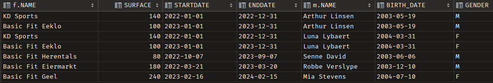
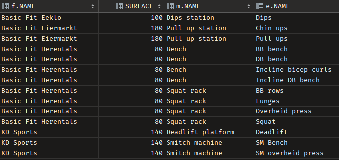
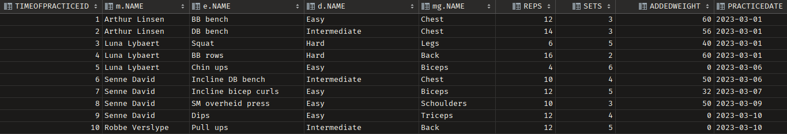
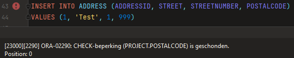
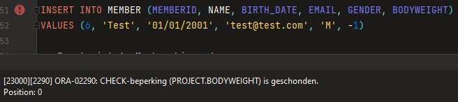
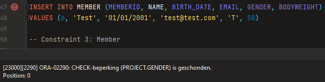
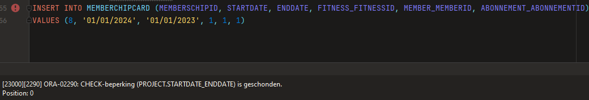

Milestone 3: Creatie Databank
---

    Identity columns
---
- Mandatory
  - Fitness: fitness_id
  - Address: address_id
  - Memberchip: memberchip_id
  - Member: member_id
  - Abonnement: Abonnement_id
  - TimeOfPractice: timeofpractice_id
  - Machine: Machine_id
  - Exercise: Exercise_id
  - Difficulty: difficulty_id
  - Musclegroup: musclegroup_id

      Table Counts
---

    @query 1: Relatie Veel-op-veel

    SELECT f.NAME, f.SURFACE, mc.STARTDATE, mc.ENDDATE, m.NAME, m.BIRTH_DATE, m.GENDER FROM FITNESS f
    JOIN MEMBERCHIPCARD mc on f.FITNESSID = mc.FITNESS_FITNESSID
    JOIN MEMBER m on mc.MEMBER_MEMBERID = m.MEMBERID;
--- 

    @query 2: 2 niveau’s diep

    SELECT f.NAME, f.SURFACE, m.NAME, e.NAME FROM FITNESS f
    JOIN MACHINE m on f.FITNESSID = m.FITNESS_FITNESSID
    JOIN EXERCISE e on m.MACHINEID = e.MACHINE_MACHINEID
    ORDER BY f.NAME, m.NAME, e.NAME;
--- 

    @query 3: Time of practice

    SELECT t.TIMEOFPRACTICEID, m.NAME, e.NAME, d.NAME, mg.NAME, t.REPS, t.SETS, t.ADDEDWEIGHT, t.PRACTICEDATE FROM TIMEOFPRACTICE t
    JOIN MEMBER m on t.MEMBER_MEMBERID = m.MEMBERID
    JOIN EXERCISE e on t.EXERCISE_EXERCISEID = e.EXERCISEID
    JOIN DIFFICULTY d on d.DIFFICULTYID = e.DIFFICULTY_DIFFICULTYID
    JOIN MUSCLEGROUP mg on e.MUSCLEGROUP_MUCLSEGROUPID = mg.MUCLSEGROUPID
    ORDER BY t.TIMEOFPRACTICEID;
--- 

    @query 4: Memberchipcard
    SELECT mc.MEMBERSCHIPID, mc.STARTDATE, mc.ENDDATE, ab.NAME, f.Name, ad.POSTALCODE, m.NAME FROM FITNESS f
    JOIN ADDRESS ad on f.ADDRESS_ADDRESSID = ad.ADDRESSID
    JOIN MEMBERCHIPCARD mc on f.FITNESSID = mc.FITNESS_FITNESSID
    JOIN ABONNEMENT ab on ab.ABONNEMENTID = mc.ABONNEMENT_ABONNEMENTID
    JOIN MEMBER m on mc.MEMBER_MEMBERID = m.MEMBERID
    ORDER BY mc.MEMBERSCHIPID;
--- 

  Bewijs Domeinen - constraints M2
--- 
    Address: postalcode - >= 1000 AND <= 9999

---

    Member: bodyweight > 0

---

    Member: gender - M OR F

---

    Membershipcard: startdate < enddate

---

